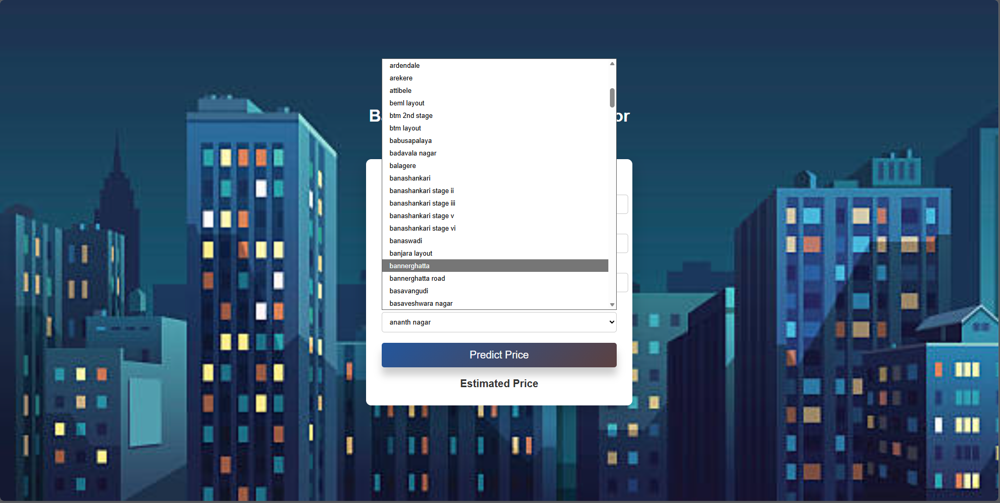
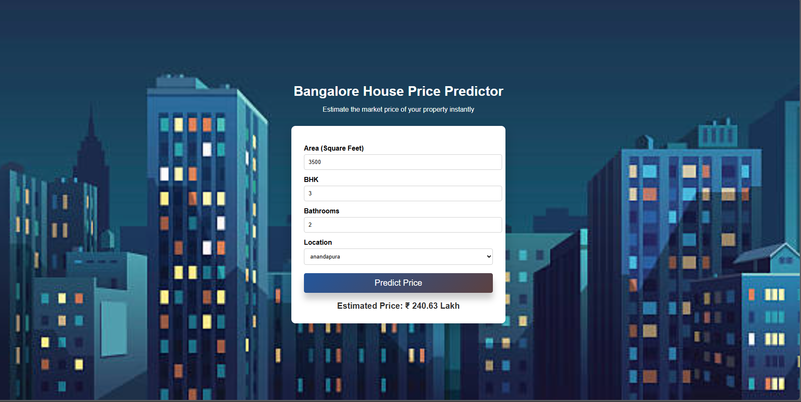
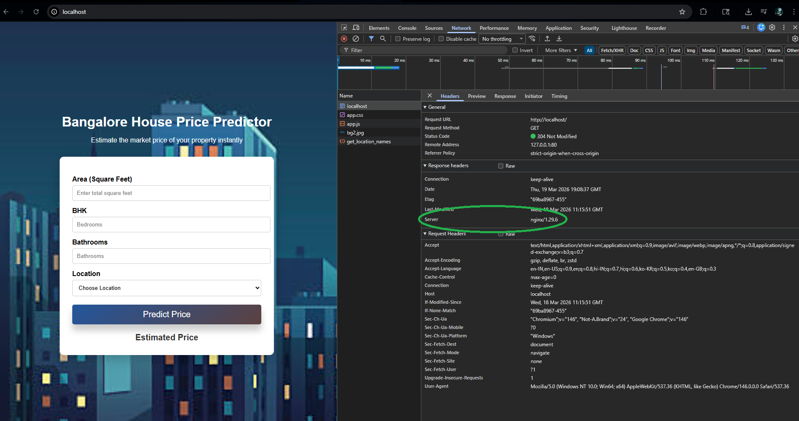
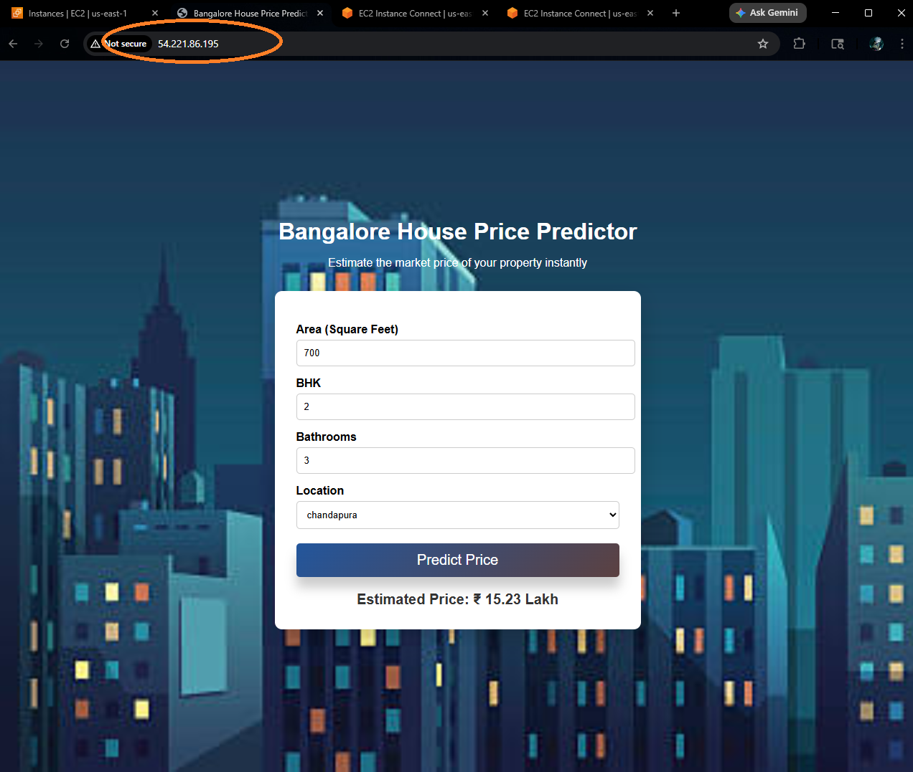

# Real_Estate_Price_Prediction_End_to_End

## Description
A redo of the Banglore House Pricing Dataset project I did a few years ago.
This project is an end-to-end real estate price prediction system that estimates property prices based on key features such as square footage, number of bedrooms, bathrooms, and location. It simulates a real-world data science workflow similar to platforms like Zillow and MagicBricks, where automated valuation tools assist users in estimating property values.

### Why This Project Exists (Problem It Solves)

Accurate property valuation is critical in the real estate industry for buyers, sellers, and agents. Manual estimation is often inconsistent and time-consuming.

This project addresses that problem by:

Automating price estimation using historical data
Providing consistent and data-driven predictions
Making property valuation accessible through a simple web interface

It reflects real-world scenarios where data scientists build scalable solutions to support business decision-making.

### What the Project Does
Predicts housing prices using machine learning
Provides an interactive web interface for users to input property details
Returns estimated property prices in real-time
Demonstrates full-stack integration of ML models into a web application

## Demo

### Web Application Interface
The web application provides an intuitive interface for users to input property details and receive price predictions.


The application dynamically fetches available locations from the backend via the `/get_location_names` API endpoint, ensuring the dropdown remains updated.



Based on the provided inputs, the system predicts property prices (in lakhs) using the trained machine learning model.



### Deployment with NGINX
The application is deployed using **NGINX** as a reverse proxy, routing client requests to the backend server.



- The NGINX configuration file is available at: `nginx.config`  
- Note: Configuration may differ for Linux environments. Refer to `AWS.md` for Linux-specific configuration setup.

### Cloud Deployment (AWS)
The application was deployed on a cloud server as the final step of the project.
U can find the app at [http://54.221.86.195:5000](http://54.221.86.195:5000)



- All deployment steps and bash commands are documented in: `AWS.md`  
- Additional configuration changes required for running on a Linux server are also detailed in this file.

## Tech Stack

- **Programming Language:** Python  
- **Frontend:** HTML, CSS, JavaScript  
- **Backend:** Flask  
- **Machine Learning:** Scikit-learn  
- **Data Processing:** Pandas  
- **Visualization:** Matplotlib  
- **Deployment & Hosting:** NGINX (used for local and cloud hosting)

## Model Information
How the Model Works

The model is trained on a housing dataset (Bangalore real estate data) sourced from Kaggle. The workflow follows a standard machine learning pipeline:

1. Data Preprocessing
Data Cleaning: Handling missing values and inconsistent data
Outlier Removal: Eliminating extreme values that could skew predictions
Feature Engineering: Creating meaningful features from raw data
Dimensionality Reduction: Reducing irrelevant or redundant features
2. Model Building
Implemented using supervised machine learning techniques via scikit-learn
The model learns relationships between input features (e.g., location, size) and output (price)
Trained on historical data to generalize predictions for unseen inputs
3. Model Deployment
The trained model is serialized using a pickle file
A backend server is built using Flask
The server exposes HTTP endpoints for prediction requests
A frontend built with HTML, CSS, and JavaScript interacts with the backend via API calls

## Model Details

Multiple regression algorithms were implemented and evaluated to identify the most effective model for predicting housing prices. The models considered include:

- Linear Regression  
- Lasso Regression  
- Decision Tree Regression  

### Model Selection Strategy

To ensure optimal performance, **hyperparameter tuning** and model comparison were conducted using **GridSearchCV**. This approach systematically evaluates different parameter combinations using cross-validation to select the best-performing model.

### Model Performance Comparison

| Model               | Best Score | Best Parameters                                      |
|--------------------|-----------|------------------------------------------------------|
| Linear Regression  | 0.855409  | `{'fit_intercept': False}`                          |
| Lasso Regression   | 0.721939  | `{'alpha': 1, 'selection': 'cyclic'}`               |
| Decision Tree      | 0.764533  | `{'criterion': 'friedman_mse', 'splitter': 'random'}` |

### Final Model Selection

Based on cross-validation performance, **Linear Regression** emerged as the best-performing model with an accuracy score of **85.5%**.

This indicates that a relatively simple linear model was sufficient to capture the underlying relationships between features and property prices, outperforming more complex models like Lasso and Decision Tree in this case.

### Key Takeaways

- Simpler models can outperform complex ones when the data has strong linear relationships  
- Proper hyperparameter tuning is crucial for fair model comparison  
- Cross-validation ensures robustness and reduces overfitting risk  

## Installation

Follow the steps below to set up and run the project locally:

1. Install Dependencies
```bash
pip install -r requirements.txt
```

2. Run the Backend Server
```bash
python server/server.py
```
3. And click on the html file in client folder.

> For detailed bash commands used during development, refer to: CODE.md

## Project Structure

The project follows a modular structure separating the frontend, backend, and machine learning components for better scalability and maintainability.
``` bash
Real_Estate_Price_Prediction_End_to_End/
│
├── client/                         # Frontend (UI)
│   ├── app.html                   # Main HTML file
│   ├── app.css                    # Styling
│   └── app.js                     # Client-side logic
│
├── model/                          # Model development
│   ├── banglore_house_price.ipynb # Data analysis & model training
│   ├── banglore_house_price_model.pkl  # Trained model
│   └── columns.json               # Feature columns used in model
│
├── server/                         # Backend (Flask server)
│   ├── artifacts/                 # Model artifacts for production
│   │   ├── banglore_house_price_model.pkl
│   │   └── columns.json
│   ├── server.py                  # API server
│   └── util.py                    # Helper functions
│
├── images/                         # Screenshots for README
│   └── (all project images)
│
├── nginx.config                    # NGINX configuration file
├── requirements.txt                # Python dependencies
├── CODE.md                         # Linux-specific setup/config
├── AWS.md                          # Cloud deployment steps (AWS)
└── README.md                       # Project documentation
```